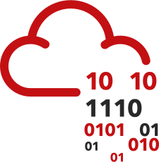

#  TryHackMe: Zero to Hero 🛡️

A curated, **0-cost** roadmap and daily tracker for cybersecurity beginners.

Instead of getting lost in thousands of thousands of rooms, I am documenting my daily progress by adding **one completely free TryHackMe room every day**. This repository serves as a growing, structured study guide—from absolute basics to advanced penetration testing and SOC operations.

## 🎯 Objective
- **0-Cost Learning:** Every room added here has been manually verified to work on the free tier.
- **Daily Discipline:** One new room added and completed daily to build muscle memory.
- **Community Resource:** Feel free to fork this and learn alongside me.

---

## 🗺️ The Roadmap (Daily Additions)

*Rooms are added daily as I verify and complete them.*

### 🟢 Absolute Basics (Pre-Security)
*(Rooms covering OSINT, Networking Basics, Linux Basics, etc.)*
<!-- PRE_SECURITY_ROOMS -->

### 🔵 Web Application Security
*(Rooms covering OWASP Top 10, Burp Suite, Web Fundamentals, etc.)*
<!-- WEB_SECURITY_ROOMS -->

### 🔴 Offensive Security (Jr. Pen Tester)
*(Rooms covering Nmap, Metasploit, Privilege Escalation, etc.)*
<!-- OFFENSIVE_SECURITY_ROOMS -->

### 🟣 Defensive Security (SOC Analyst)
*(Rooms covering SIEM, Wireshark, Windows Forensics, etc.)*
<!-- DEFENSIVE_SECURITY_ROOMS -->

### ⚪ Miscellaneous & Challenges
*(Free CTFs and standalone challenges)*
<!-- MISC_ROOMS -->

---

## 🤝 How to Use This Repo
1. **Fork** this repository.
2. Create your free TryHackMe account.
3. Follow the rooms as I add them daily.
4. Drop a ⭐ if you found this roadmap helpful!

*Created and maintained by [Kushal Soni (Kusharu)](https://tryhackme.com/p/kusharusan) - Top 30% Globally.*
